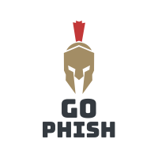

<div id="top"></div>
<!--
*** Thanks for checking out the Best-README-Template. If you have a suggestion
*** that would make this better, please fork the repo and create a pull request
*** or simply open an issue with the tag "enhancement".
*** Don't forget to give the project a star!
*** Thanks again! Now go create something AMAZING! :D
-->


<!-- PROJECT SHIELDS -->
<!--
*** I'm using markdown "reference style" links for readability.
*** Reference links are enclosed in brackets [ ] instead of parentheses ( ).
*** See the bottom of this document for the declaration of the reference variables
*** for contributors-url, forks-url, etc. This is an optional, concise syntax you may use.
*** https://www.markdownguide.org/basic-syntax/#reference-style-links
-->
[![Contributors][contributors-shield]][contributors-url]
[![Forks][forks-shield]][forks-url]
[![Stargazers][stars-shield]][stars-url]
[![Issues][issues-shield]][issues-url]
[![MIT License][license-shield]][license-url]
[![LinkedIn][linkedin-shield]][linkedin-url]


<!-- PROJECT LOGO -->
<br />
<div align="center">
  <a href="https://github.com/JBaczuk/go-phish">
    
  </a>

  <!-- <h3 align="center">Best-README-Template</h3> -->

  <p align="center">
    Script for sending phishers fake data
    <br />
    <a href="https://github.com/JBaczuk/go-phish"><strong>Explore the docs »</strong></a>
    <br />
    <br />
    <!-- <a href="https://github.com/JBaczuk/go-phish">View Demo</a> -->
    <!-- · -->
    <a href="https://github.com/JBaczuk/go-phish/issues">Report Bug</a>
    ·
    <a href="https://github.com/JBaczuk/go-phish/issues">Request Feature</a>
  </p>
</div>


<!-- TABLE OF CONTENTS -->
<details>
  <summary>Table of Contents</summary>
  <ol>
    <li>
      <a href="#about-the-project">About The Project</a>
      <ul>
        <li><a href="#built-with">Built With</a></li>
      </ul>
    </li>
    <li>
      <a href="#getting-started">Getting Started</a>
      <ul>
        <!-- <li><a href="#prerequisites">Prerequisites</a></li> -->
        <li><a href="#installation">Installation</a></li>
      </ul>
    </li>
    <!-- <li><a href="#usage">Usage</a></li> -->
    <!-- <li><a href="#roadmap">Roadmap</a></li> -->
    <li><a href="#contributing">Contributing</a></li>
    <li><a href="#license">License</a></li>
    <li><a href="#contact">Contact</a></li>
    <!-- <li><a href="#acknowledgments">Acknowledgments</a></li> -->
  </ol>
</details>


<!-- ABOUT THE PROJECT -->
## About The Project

[![Product Name Screen Shot][product-screenshot]](https://example.com)

Many people, including me, receive phishing emails trying to get personal data. This script was created in order to prevent the data from being very useful.

Of course, you should also report the domain to the owner and/or registrar, if possible.

This script will continuously generate random email addresses and passwords and submit them to the form. Currently it uses a worker pool and keepalive connections, but could definitely be improved.

<p align="right">(<a href="#top">back to top</a>)</p>


### Built With

* [Node.js](https://nodejs.org/en/)

<p align="right">(<a href="#top">back to top</a>)</p>


<!-- GETTING STARTED -->
## Getting Started

To get the scripts up and running follow these simple example steps.
<!-- 
### Prerequisites

* npm
  ```sh
  npm install npm@latest -g
  ``` -->

### Installation

2. Clone the repo
   ```sh
   git clone https://github.com/JBaczuk/go-phish.git
   ```
3. Install NPM packages
   ```sh
   npm i
   ```
4. Rename `.env.example`
   ```sh
   mv .env.example .env
   ```
5. Enter the phishing URL in `.env`
   ```
   URL=https://example.com/form.php
   ```
6. Edit the fields `sendData` function in `send.js` with the fields expected by the form.
   ```js
   data.append("username", email);
   data.append("password", password);
   ```

<p align="right">(<a href="#top">back to top</a>)</p>


<!-- USAGE EXAMPLES -->
## Usage

```sh
npm start
```
<!-- _For more examples, please refer to the [Documentation](https://example.com)_ -->

<p align="right">(<a href="#top">back to top</a>)</p>


<!-- ROADMAP -->
<!-- ## Roadmap

- [x] Add Changelog
- [x] Add back to top links
- [] Add Additional Templates w/ Examples
- [] Add "components" document to easily copy & paste sections of the readme
- [] Multi-language Support
    - [] Chinese
    - [] Spanish

See the [open issues](https://github.com/JBaczuk/go-phish/issues) for a full list of proposed features (and known issues).

<p align="right">(<a href="#top">back to top</a>)</p> -->


<!-- CONTRIBUTING -->
## Contributing

Contributions are what make the open source community such an amazing place to learn, inspire, and create. Any contributions you make are **greatly appreciated**.

If you have a suggestion that would make this better, please fork the repo and create a pull request. You can also simply open an issue with the tag "enhancement".
Don't forget to give the project a star! Thanks again!

1. Fork the Project
2. Create your Feature Branch (`git checkout -b feature/AmazingFeature`)
3. Commit your Changes (`git commit -m 'Add some AmazingFeature'`)
4. Push to the Branch (`git push origin feature/AmazingFeature`)
5. Open a Pull Request

<p align="right">(<a href="#top">back to top</a>)</p>


<!-- LICENSE -->
## License

Distributed under the MIT License. See `LICENSE.txt` for more information.

<p align="right">(<a href="#top">back to top</a>)</p>


<!-- CONTACT -->
## Contact

Jordan Baczuk - [@jbaczuk](https://twitter.com/jbaczuk)

Project Link: [https://github.com/JBaczuk/go-phish](https://github.com/JBaczuk/go-phish)

<p align="right">(<a href="#top">back to top</a>)</p>


<!-- ACKNOWLEDGMENTS -->
<!-- ## Acknowledgments

Use this space to list resources you find helpful and would like to give credit to. I've included a few of my favorites to kick things off!

* [Choose an Open Source License](https://choosealicense.com)
* [GitHub Emoji Cheat Sheet](https://www.webpagefx.com/tools/emoji-cheat-sheet)
* [Malven's Flexbox Cheatsheet](https://flexbox.malven.co/)
* [Malven's Grid Cheatsheet](https://grid.malven.co/)
* [Img Shields](https://shields.io)
* [GitHub Pages](https://pages.github.com)
* [Font Awesome](https://fontawesome.com)
* [React Icons](https://react-icons.github.io/react-icons/search)

<p align="right">(<a href="#top">back to top</a>)</p> -->


<!-- MARKDOWN LINKS & IMAGES -->
<!-- https://www.markdownguide.org/basic-syntax/#reference-style-links -->
[contributors-shield]: https://img.shields.io/github/contributors/JBaczuk/go-phish.svg?style=for-the-badge
[contributors-url]: https://github.com/JBaczuk/go-phish/graphs/contributors
[forks-shield]: https://img.shields.io/github/forks/JBaczuk/go-phish.svg?style=for-the-badge
[forks-url]: https://github.com/JBaczuk/go-phish/network/members
[stars-shield]: https://img.shields.io/github/stars/JBaczuk/go-phish.svg?style=for-the-badge
[stars-url]: https://github.com/JBaczuk/go-phish/stargazers
[issues-shield]: https://img.shields.io/github/issues/JBaczuk/go-phish.svg?style=for-the-badge
[issues-url]: https://github.com/JBaczuk/go-phish/issues
[license-shield]: https://img.shields.io/github/license/JBaczuk/go-phish.svg?style=for-the-badge
[license-url]: https://github.com/JBaczuk/go-phish/blob/main/LICENSE.txt
[linkedin-shield]: https://img.shields.io/badge/-LinkedIn-black.svg?style=for-the-badge&logo=linkedin&colorB=555
[linkedin-url]: https://linkedin.com/in/jordanbaczuk
[product-screenshot]: images/screenshot.png